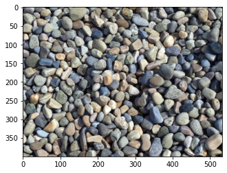
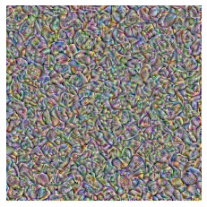
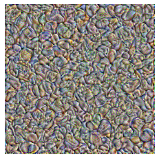
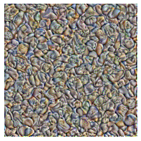
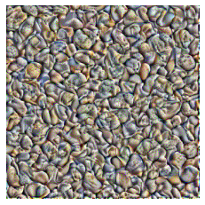
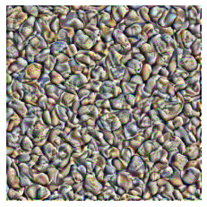
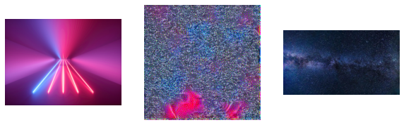
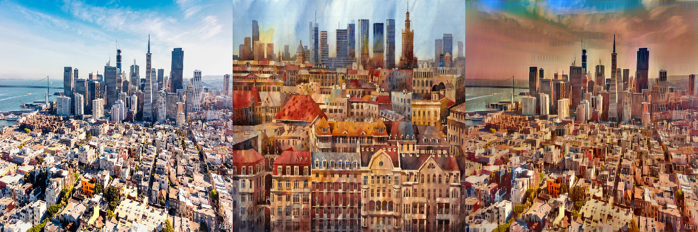

# README
# Использование преобученных нейронных сетей для стилизации изображений и генерации текстур

В этом проекте я постарался повторить несколько методов использующих веса заранее преобученных глубоких нейросетей для генерации изображений.
Все используемые методы описаны в статьях в разделе ссылки.
Также целью проекта является написание веб интерфейса с используование фреймворка ruby rails
### Описание задачь
#### 1. Генерация текстур по шаблону
Описание: Начиная с случайного шума, путём пропускания картинки через слои глубокой нейросети
добиться наибольшей схожести сгенерированной картинки с одним или несколькими шаблонами
Примеры:
---------------------
*Изаначальный шаблон*

*Этапы генерации:*

----------------------------------------------
*Пример генерации по нескольким шаблонам:*

#### 2. Стилизация изображений
Описание: стилизация изображения сохраняя его структурные особенности но с наложением текстуры с другого изображения(ий).
Данный алгоритм неплохо описан в статье в ССылках.
Данный алгоритм схож с тем что используется в [Prisma](https://prisma-ai.com/) и схожих приложениях

пример с сайта https://www.machinelearningmastery.ru/style-transfer-styling-images-with-convolutional-neural-networks-7d215b58f461/

## ССылки
* [Статья о стилизации картинок](https://arxiv.org/pdf/1610.07629.pdf)
* [Статья о генерации текстур](https://arxiv.org/pdf/2009.01376.pdf)
